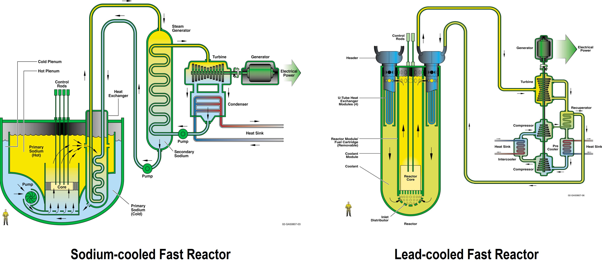

Welcome
#######
ROOSTER (**R**\ obust **O**\ bject-**O**\ riented **S**\ olver of **T**\ ransport **E**\ quations in a **R**\ eactor) is a software developed to model a steady-state and transient behaviour of Generation-IV nuclear systems using fast neutron spectrum and liquid metals for cooling (:ref:`Gen-IV SFR and LFR<Figb60d62c0>`).

.. _Figb60d62c0:

  Generation-IV SFR and LFR [GIF]_

The code is open source (`ROOSTER GitHub repository <https://github.com/rooster-code/rooster>`_), multiphysics, object-oriented, written in Python 3 with Fortran 2009  math kernels.

The code includes

* physical models for:

    - neutronics;
    - coolant thermal hydraulics;
    - heat transfer in heat structures; and

* mathematical tools, including:
    
    - ordinary differential equation solver;
    - symbolic and linear algebra.

.. toctree::
    :maxdepth: 2
    :hidden:

    motivation
    input
    theory
    examples
    references
