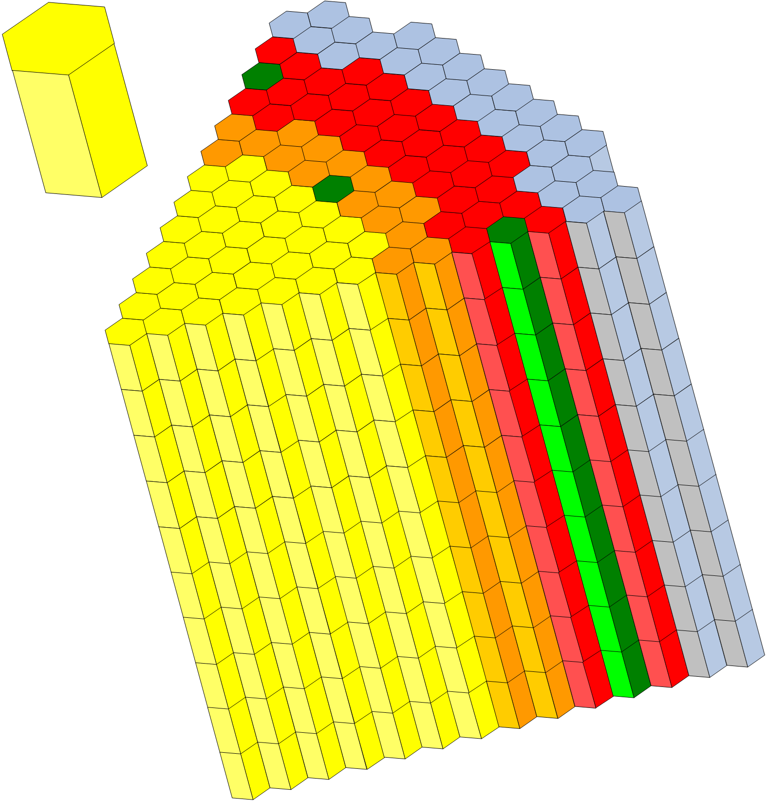
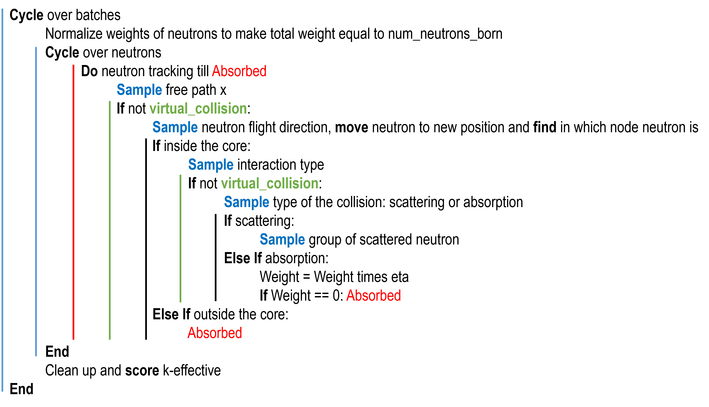

Theory: Neutronics
==================

How to prepare cross sections?
------------------------------
To prepare the nuclear cross-section input files for ROOSTER follow these steps:

* For each isotope required in your model, download the Point-wise Evaluated Nuclear Data (PENDF) file. You can obtain these files from sources like the `IAEA Nuclear Data Services <https://www-nds.iaea.org/exfor/endf.htm>`_.\n

..

* Install the open-source LANL NJOY21 code, which is available at `NJOY21 GitHub repository <https://github.com/njoy/NJOY21>`_.

..

* Utilize NJOY21 to convert the PENDF files into GENDF files for each isotope. Here is an  :download:`example </_static/U238j311.inp>` of the input file for NJOY21 for the PENDF-to-GENDF conversion of the U-238 nuclear data from the JEFF3.1.1 library.

..

* Move all files in ROOSTER Nuclear Data Directory and specify its name in the input file card :ref:`input nddir`.

..

* Use the GENDF filenames in the fields ``isoid`` of the input file card :ref:`input mix` to specify homogeneous mix of isotopes.

How to build a core model?
--------------------------
The calculational area is divided in the nodes, i.e. square or hexagonal prisms with the same dimensions in the (x,y) surface and if necessary different axial heights. The image below shows the :ref:`Fig6d872d52`. Every node in the (x,y) surface corresponds to a subassembly.
Every color denotes a homogeneous material.

.. _Fig6d872d52:

  Typical nodalisation for 60-deg symmetry sector of fast reactor core model

The core model is build in the following four steps:

* Specify the core geometry, using the input file card :ref:`input coregeom`.
* Specify homogeneous mixes of isotopes as specified in the previous section, using the input file card :ref:`input mix`.
* Create models of subassemblies using the input file cards :ref:`input stack`.
* Assemble stacks in the core using  the input file cards :ref:`input coremap`.

How to solve eigenvalue problem?
--------------------------------
Specify ``eigenvalueproblem`` in the input file card :ref:`input solve` using the number of energy groups ``ng`` consistent with the GENDF files generated by NJOY (see above) and ``meth`` : method used by an eigenvalue solver ``meth``, which can be either ``DIF`` the for finite-difference neutron diffusion solver or ``MC`` for the Monte Carlo solver.

Finite-difference neutron diffusion solver
^^^^^^^^^^^^^^^^^^^^^^^^^^^^^^^^^^^^^^^^^^

Monte Carlo solver
^^^^^^^^^^^^^^^^^^
The Monte Carlo method is a technique for estimating the expected value of a random variable together with its standard deviation.

* In reactor physics it is done by a direct simulation of a population of neutrons by sampling individual neutrons.

..

* For each neutron a sequence of physical random events is simulated using a sequence of random numbers.

.. 

* Some parameters of average behavior of the population are recorded (scored).

Assumptions
"""""""""""
The Monte Carlo solver is based on the following assumptions:

* Multi-group representation of nuclear data.
* Homogeneous representation of reactor lattice using coarse structured mesh.
* Scattering is isotropic.
* Each neutron is assigned with a statistical weight W and 

    - represents the contribution of several particles (W > 1); or
    - has the same significance as analog simulation (W = 1); or
    - has less significance than analog simulation (W < 1).

Neutron tracking
""""""""""""""""
Neutron tracking simulates how a single neutron moves through the reactor core.

A neutron track is the direct path a neutron follows between two interactions (collisions). This path may extend across the boundary between different materials.

A neutron history comprises all the tracks created from the initial emission to the eventual absorption or escape of a neutron.

To sample the next collision point without considering surface crossings, the ROOSTER Monte Carlo solver employs a **delta-tracking** technique. 
The primary concept involves augmenting each material :math:`i` with a suitable virtual collision cross-section :math:`{\Sigma_V^{g(i)}}`. 
This augmentation ensures that the adjusted total cross-section :math:`{\Sigma_m^g}` maintains uniformity across all materials.

.. math::  \Sigma_m^g = \Sigma_t^{g(i)} + \Sigma_V^{g(i)}
  :label: Eq_neut01

where :math:`{\Sigma_m^g}` is the majorant, maximum of all total cross sections in the system (the same for all materials), :math:`g` the energy group and :math:`i` the material index.

Instead of heterogeneous material composition we obtain one pseudo-homogeneous material for the whole core. This eliminates the need to adjust the free path length each time neutron enters new material and the need to calculate surface distances.

The sampling of the free path length between two collision points (:math:`0` and :math:`x`) serves as the foundation of neutron tracking. In a pseudo-homogeneous medium, the distance traveled by neutrons between collisions in a particular energy group (:math:x^g) is determined by:

.. math::  x^g = -\frac{ln(\xi)}{\Sigma_m^g}
  :label: Eq_neut02

where :math:`{\xi}` is a random number uniformly distributed between 0 and 1.

At a new collision point, the collision type (real or virtual) is determined by sampling the partial probability of a virtual collision and comparing it to a random variable, denoted as :math:`{\xi}` : 

.. math::  P_V = \frac{\Sigma_V^{g(i)}}{\Sigma_m^g}
  :label: Eq_neut03

If :math:`{P_V > \xi}` the collision is virtual and the sampling of the free path is repeated, otherwise the collision is real and the collision type is sampled (scattering or absorption), by comparing partial probability of scattering to random :math:`{\xi}` :

.. math::  P_S = \frac{\Sigma_S^{g(i)}}{\Sigma_t^{g(i)}}
  :label: Eq_neut04

If :math:`{P_S > \xi}` the collision is scattering, otherwise the collision is absorption.

In other words: the neutron always travels by steps (free paths) determined by the most "opaque" material in the system and when it realizes that it is unnecessarily too short it just continues.

Direction and energy of secondary neutron are sampled independently:

* :math:`{cos\theta = 2\xi_1 - 1}` and :math:`{\phi = 2\pi \xi_2}`, where :math:`{\xi_1}` and :math:`{\xi_2}` are two random numbers from 0 to 1:

..

* secondary neutron energy :math:`{E'}` is sampled by the numerical integration of Probability Density Function (PDF) :math:`{F^{g \rightarrow g'}}` until it becomes higher than :math:`{\xi}`, the random number from 0 to 1.

.. _Fig80a494dc:

  ROOSTER Monte Carlo solver in a nutshell 
